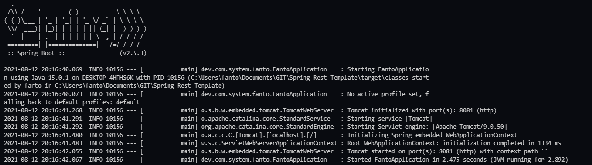

# Spring_Rest_Template
Template de SpringBoot de uma API REST

## Criando um Projeto Inicial

Como é sempre a mesma estrutura inicial do SpringBoot, foi criado um site que nos entrega o template básico para começarmos o desenvolvimento, o [start.spring.io](https://start.spring.io).

---

Para alterar a porta do projeto, coloque no arquivo **application.properties** o seguinte comando:

* `server.port=8081`

---

Para iniciar o projeto maven, vá no diretório onde possui o arquivo **mvnw** e use o seguinte comando:

```shell
./mvnw spring-boot:run
```

você sabe que está rodando quando aparece escrito **Tomcat initialized with port(s): 8081 (http)**



Para acessar a página vá no seu browser para `localhost:8081`